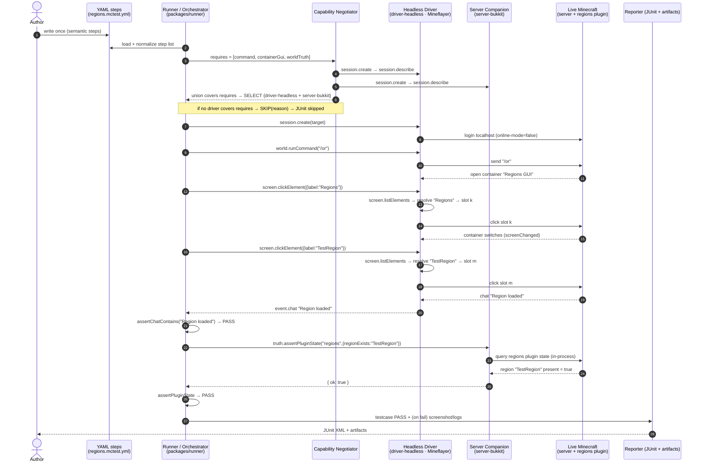
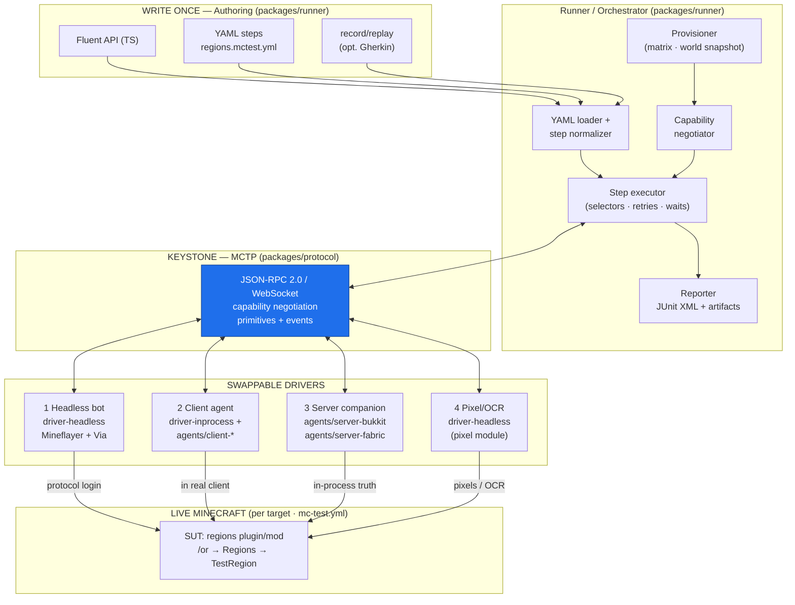

# mc-test — Architecture

> **Status:** Big-picture / onboarding. This is the orientation doc — it explains
> how the pieces fit together and is the place to start reading. It is **not** a
> source of truth for wire names. For the wire contract (envelopes, methods,
> params/results, error model, events, capability keys, selector keys, testId
> carriers, protocol version) **`PROTOCOL.md` is the single source of truth**;
> this doc defers to it and uses its spellings. The other specialist docs are
> likewise authoritative within their scope: `CAPABILITIES.md` (capability
> semantics), `SELECTORS.md` (selector grammar), `DRIVERS.md` (per-driver
> capability sets + field shapes), `ROADMAP.md` (build order), and
> `ENVIRONMENTS.md` (`mc-test.yml` schema + provisioning). When this doc and a
> specialist doc disagree, **the specialist doc wins.**

`mc-test` is a generalized, WebDriver/Appium-style automated testing framework
for Minecraft **plugins and mods**, across many Minecraft versions and loaders
(Spigot/Paper/Folia; Fabric/Forge/NeoForge/Quilt; MC 1.8 → 1.21 and beyond).

You author a test **once** in semantic steps:

```
join localhost → run /or → click "Regions" → click "TestRegion"
  → assert chat contains "Region loaded"
  → assert (server) region "TestRegion" exists
```

…and run it **across the whole matrix** — every (loader × version × driver)
combination declared in `mc-test.yml` — validating pass/fail from **real
runtime state**, not from a mock.

---

## 1. The narrow-waist model

The whole system is one **narrow waist** (a.k.a. hourglass). The genius of a
narrow waist is that it lets the wide, churning top evolve independently from
the wide, churning bottom, because everything is forced through **one small,
stable contract** in the middle.

```
        WRITE ONCE (wide, stable to authors)
   ┌───────────────────────────────────────────────┐
   │  Authoring layer                               │
   │  fluent API · YAML steps · record/replay ·     │
   │  optional Gherkin                              │
   └───────────────────────────────────────────────┘
                        │
                        ▼
        ╔═══════════════════════════════════════════╗
        ║   THE KEYSTONE — ONE STABLE CONTRACT       ║
        ║   MC Test Protocol (MCTP)                  ║
        ║   JSON-RPC 2.0 over WebSocket              ║
        ║   language-neutral · capability-negotiated ║
        ╚═══════════════════════════════════════════╝
                        │
        ┌───────────┬───┴───────┬───────────────┐
        ▼           ▼           ▼               ▼
   ┌─────────┐ ┌─────────┐ ┌──────────┐  ┌──────────┐
   │ headless│ │inprocess│ │ server   │  │ pixel    │
   │ bot     │ │ client  │ │ companion│  │ /OCR     │
   │ driver  │ │ agent   │ │ agent    │  │ driver   │
   └─────────┘ └─────────┘ └──────────┘  └──────────┘
        MANY SWAPPABLE DRIVERS (wide, churning bottom)
```

- **Top (write once):** a stable test-authoring layer. Authors never learn a
  loader API or a Minecraft version quirk. They write semantic steps.
- **Middle (the keystone):** exactly **one** contract, **MCTP** — JSON-RPC 2.0
  over WebSocket, language-neutral, with Appium-style **capability
  negotiation**. Everything crosses this boundary. Nothing bypasses it.
- **Bottom (many swappable drivers):** drivers are selected **per target** by
  capabilities. Add a driver, span a new version, support a new loader — the top
  and the contract do not change.

**Two prime consequences of the waist:**

1. **Runner language and game language are decoupled.** The runner speaks MCTP
   over a socket; it does not care that an agent is written in Java/Kotlin, or
   that another driver is a Node process built on Mineflayer.
2. **Version-specific code is quarantined.** All the obfuscation-mapping pain
   (Yarn / MCP / Mojmap) and all loader-API differences live **below** the
   waist, inside tiny dumb agents. Everything above the waist is
   version-independent.

### Prime directives (non-negotiable)

- **Push version-specific code into tiny dumb agents.** In-game agents expose
  **primitives only** (see §4.2 for the exact method list). **All intelligence**
  — selector resolution strategy, assertions, retries, orchestration, reporting
  — lives **outside** the game in version-independent code. We generate per-loader
  agent variants from **one shared core**; only the thin agent shim recompiles
  per (loader × version).
- **Semantic selectors, never coordinates or slot indices.** A test says
  `screen.clickElement(label: "Regions")`. Each driver **resolves** that selector its
  own way (bot: inventory slot display-name; client mod: `ClickableWidget`
  `getMessage`; pixel: OCR/template match). SUTs we control may emit invisible
  `testId` tags (NBT / data component) for robust selection.
- **Capability negotiation.** Drivers advertise capabilities; tests declare
  required capabilities; the runner picks a compatible driver and **skips with a
  clear reason** when none fits. Fast plugin tests run headless in CI; only true
  client-GUI mod tests pay for a rendered client.
- **Protocol-first.** MCTP is the keystone; every backend is *just another
  driver*. The runner is swappable precisely because of the protocol.

---

## 2. Components and responsibilities

This section names every component and states exactly what it owns. Boundaries
are deliberate: each box does one job, and the **only** way boxes talk across
the waist is MCTP.

### 2.1 Authoring layer — *write the test once*

**Package:** `/packages/runner` (authoring front-ends ship with the runner).

The authoring layer turns human intent into a **normalized step list** — an
in-memory array of step objects the runner executes. It offers three equivalent
front-ends, all of which compile to the same step list:

1. **Fluent API (TypeScript).** For programmatic tests:

   ```ts
   import { test, requireCapabilities } from "@mc-test/runner";

   test("regions: open and load TestRegion", (t) => {
     requireCapabilities(t, ["command", "containerGui", "worldTruth"]);
     t.join("localhost");
     t.command("/or");
     t.click({ label: "Regions" });
     t.click({ label: "TestRegion" });
     t.assertChatContains("Region loaded");
     t.assertPluginState("regions", { regionExists: "TestRegion" });
   });
   ```

2. **YAML step files (`*.mctest.yml`).** The default, language-neutral surface.
   See §3 for the canonical regions YAML and its field schema.

3. **Record/replay (optional Gherkin).** A recorder attaches as an MCTP client,
   watches a human drive a live session, and emits a YAML step file (or a
   Gherkin `.feature` + step bindings). Replay just runs the emitted steps.

**Owns:** step normalization, selector literal syntax, the `requires:` capability
declaration. **Does not own:** how a step executes, how a selector resolves, or
which driver runs (those are runner + driver concerns).

### 2.2 MCTP — *the one stable contract* (the keystone)

**Package:** `/packages/protocol` (TypeScript types + JSON Schema).

MCTP is **JSON-RPC 2.0 over WebSocket**. It is language-neutral and defines:

- the **handshake + capability negotiation** (`session.create` / `session.describe`),
- the **primitive method set** every driver/agent implements (§4.2),
- the **selector object** schema (§2.7),
- the **event stream** (server→client notifications: chat lines, screen changes),
- the **error model** (typed JSON-RPC error codes; see `PROTOCOL.md`).

MCTP is the **single** crossing point of the waist. The runner is an MCTP
*client*; every driver/agent is an MCTP *server*. Full method/error tables — and
the **authoritative spelling of every name used below** — live in `PROTOCOL.md`;
this doc only references them.

### 2.3 Runner / orchestrator — *the intelligence*

**Package:** `/packages/runner` (TypeScript / Node CLI).

The runner is where **all** the smarts live (per the prime directive). It:

- **loads** `mc-test.yml` (the matrix) and the test step files,
- **provisions** each target Testcontainers-style (auto-download server jar +
  loader, install SUT + matching agent, copy a **pristine world snapshot** per
  test, boot `online-mode=false`); provisioning detail lives in `ENVIRONMENTS.md`,
- **negotiates capabilities**: intersects each test's `requires:` with each
  target driver's advertised capabilities, and **selects** a driver or **skips
  with a reason**,
- **executes** the normalized step list by issuing MCTP calls,
- owns **all selector resolution policy, retries, waits, and timeouts** (drivers
  only perform a single primitive; the *loop* that retries is the runner's),
- **collects artifacts** and hands results to the reporter.

**Swap-path:** because the runner only speaks MCTP, it is replaceable. The
default is TypeScript/Node (unlocks Mineflayer immediately). A **Kotlin/Java
runner on MCProtocolLib** is a supported alternative — it would re-implement the
same MCTP client + YAML loader + JUnit reporter and nothing below the waist
changes. See §6.

### 2.4 The four drivers — *swappable backends*

Each driver is an MCTP **server** that advertises a capability set and resolves
semantic selectors in its own medium. Full matrix in §4; capability keys in §5.

| # | Driver | Package | Lives where | Tests what |
|---|--------|---------|-------------|------------|
| 1 | **Headless protocol bot** | `/packages/driver-headless` | Node process (Mineflayer) | chat/commands, inventory GUIs, world-truth (via server agent) |
| 2 | **In-process client agent** | `/packages/driver-inprocess` + `/agents/client-*` | inside the **real** client | client `Screen`s/widgets, rendering, screenshots |
| 3 | **Server-side companion agent** | `/agents/server-bukkit`, `/agents/server-fabric` | inside the server | native world-truth, plugin-state, fixtures, fake players |
| 4 | **Pixel/OCR driver** | `/packages/driver-pixel` | any rendered client | universal last resort; brittle |

Driver #3 is special: it is usually a **companion** that rides *alongside*
another driver (it answers `world.*` / `assertPluginState` while the bot or
client mod drives the UI). It can also stand alone for pure server-state tests.

### 2.5 In-game agents — *tiny, dumb, version-specific*

**Packages:** `/agents/core` (shared) + `/agents/client-fabric`,
`/agents/client-forge`, `/agents/client-neoforge` (thin client shims) +
`/agents/server-bukkit`, `/agents/server-fabric` (server shims).

The agent is the **only** code that knows a Minecraft version. It is deliberately
stupid: it receives a primitive MCTP call, performs exactly that primitive
against the live game using version-correct mappings, and returns a plain JSON
result. It contains **no** selectors logic-of-choice, **no** assertions, **no**
retries. `/agents/core` holds the MCTP server + primitive dispatch (shared,
version-independent); each thin shim binds the primitives to one loader's API and
recompiles per (loader × version). Obfuscation mappings (Yarn/MCP/Mojmap) are the
**per-version tax** — isolated entirely inside the shim. Detail in `DRIVERS.md`.

### 2.6 Server companion — *world-truth + plugin-state*

A specialization of the in-game agent (driver #3) that runs server-side as a
Bukkit/Paper **plugin** (`/agents/server-bukkit`, MCTP `agent.kind: serverPlugin`)
or a server **mod** (`/agents/server-fabric`). It answers the authoritative-state
primitives (`truth.getWorldBlock`, `truth.getEntities`, `truth.assertPluginState`)
and the setup primitives (`fixture.set`, `fixture.reset`, `player.spawnFake`,
`player.despawnFake`). This is how the canonical regions test proves that region
`"TestRegion"` **actually exists** in the plugin, not just that a chat line appeared.

**Multi-connection session (the companion is its own MCTP server).** The server
companion listens on its **own** MCTP port, independent of the UI driver. A test
that needs both a UI surface and server truth therefore runs over **two MCTP
connections** unified behind one logical session (the runner's `SessionGroup`): the
runner fans GUI/chat steps to the UI driver connection and `truth.*` / `fixture.*` /
`player.*` steps to the companion connection. The negotiator reasons about the
**union** of both connections' advertised capabilities (§5); the test author writes
no connection plumbing. When no companion is co-selected, the server-owned steps
**skip with a reason** rather than pass. SUTs we control expose plugin state and
custom fixtures to the companion through two pure-Java SPIs shipped in
`/agents/core` — `McTestStateProvider` and `McTestFixtureProvider` — registered via
the Bukkit `ServicesManager`. (This is the M3 milestone; see `ROADMAP.md` §4 and the
wire sequence in `PROTOCOL.md` §11.)

### 2.7 Selector model — *semantic, never coordinates*

Every step that touches the UI carries a **selector object**. Drivers resolve it;
authors never write a slot index or pixel. Supported keys:

| Key | Meaning |
|-----|---------|
| `label` | exact visible display name (e.g. `"Regions"`) |
| `textContains` | substring match on visible text |
| `loreContains` | substring match on item lore / tooltip |
| `itemType` | match by item/material id (e.g. `minecraft:paper`) |
| `role` | semantic role (`button`, `slot`, `tab`, `input`, `label`, `list`, `listItem`) |
| `index` / `nth` | the nth match (0-based) when several match |
| `within` | restrict the search to a named container/region/screen |
| `testId` | invisible tag we emit on SUTs we control (NBT / data component) |

`testId` is the most robust: a plugin/mod we own stamps an invisible tag — NBT key
`mctp:testId` on the `ItemStack`, or the `mc-test:test_id` data component on
1.20.5+ — so selection survives translation, recoloring, and layout churn.

### 2.8 Reporter — *evidence, not vibes*

**Package:** `/packages/runner` (reporter module).

Emits **JUnit XML** (one `<testsuite>` per target, one `<testcase>` per test) so
any CI consumes results natively, plus **artifacts on failure**: screenshots
(driver #2 / #4 via `screenshot`), server log, client log, and optional video.
Each artifact is linked from the JUnit `<system-out>` and written under
`./artifacts/<target>/<test>/`.

---

## 3. End-to-end data flow — the canonical regions test

The canonical SUT is a **regions** plugin/mod: `/or` opens a GUI with a
**"Regions"** button leading to entries like **"TestRegion"**; clicking
`TestRegion` loads it (chat: `"Region loaded"`) and the plugin then holds a
region named `TestRegion`.

### 3.1 The test as YAML (`/examples/regions/regions.mctest.yml`)

```yaml
# regions.mctest.yml — authored ONCE, runs across the whole matrix.
test: "regions: open and load TestRegion"

# Capability negotiation: the runner runs this test only on targets whose
# selected driver advertises ALL of these. Otherwise it SKIPS with a reason.
requires:
  - command            # send /or
  - containerGui       # click items in a chest-style GUI (headless-friendly)
  - worldTruth         # server companion can assert plugin/world state

steps:
  - join: "localhost"

  - command: "/or"

  # Semantic selectors only — no slot index, no pixel.
  - click: { label: "Regions" }
    waitFor: { screenChanged: true }     # runner-owned wait; driver stays dumb

  - click: { label: "TestRegion" }

  - assertChatContains: "Region loaded"

  # Proven from REAL runtime state via the server companion agent:
  - assertPluginState:
      plugin: "regions"
      expect: { regionExists: "TestRegion" }
```

**YAML field schema (the contract):** top-level `test` (string), `requires`
(list of capability keys, §5), `steps` (ordered list). Each step is a
single-key map whose key is a **step verb**: `join`, `command`, `click`,
`type`, `pressKey`, `assertChatContains`, `assertElementExists`,
`assertPluginState`, `screenshot`. Optional per-step modifiers: `waitFor`
(`{ screenChanged | chatContains | elementVisible }`), `timeoutMs` (number),
`within` (selector scope). Step verbs map 1:1 onto MCTP primitives in §4.2;
`assert*` verbs are evaluated by the **runner** against primitive results.

### 3.2 Sequence — YAML → pass/fail



**Reading the flow:**

1. **Author → runner.** The runner loads `regions.mctest.yml` and normalizes it
   into a step list. Nothing version-specific is known yet.
2. **Negotiation.** The runner asks each candidate driver for capabilities
   (`session.create` → `session.describe`). For a headless CI target, the
   **headless driver** (`command`, `containerGui`) plus the **server
   companion** (`worldTruth`) together cover `requires`. They are selected. If
   a target offered neither, the runner **skips** this test on that target with a
   reason like `"missing capability: worldTruth"`, recorded as JUnit *skipped*.
3. **Drive the UI (primitives only).** `world.runCommand("/or")` → the regions GUI
   opens. For each `click`, the driver calls `screen.listElements` to enumerate the
   container, **resolves** the semantic selector (`label:"Regions"` → the slot whose
   display-name is `Regions`) to a concrete slot, then issues `screen.clickElement`. The
   *resolution policy and any retry/wait loop are the runner's*; the driver only
   performs the single primitive it was told to.
4. **Assert from real state.** `assertChatContains("Region loaded")` is checked
   by the runner against the chat event stream. `assertPluginState` is answered
   by the **server companion** querying the regions plugin **in-process** — the
   authoritative truth that `TestRegion` exists.
5. **Report.** The runner emits a JUnit `<testcase>`; on failure it attaches a
   screenshot (if the driver advertises `screenshot`), the server log, and the
   client log under `./artifacts/<target>/<test>/`.

**Same YAML, different driver:** if the regions UI were a **client-rendered mod
Screen** (not an inventory container), the headless bot **cannot see it**
(no `clientScreens`). The negotiator then selects the **in-process client agent**
(driver #2), whose `screen.clickElement` resolves `label:"Regions"` against
`ClickableWidget.getMessage()`. The YAML is byte-for-byte identical; only the
selected driver changes. This is the entire point of the waist.

---

## 4. The four drivers in detail

### 4.1 Capability matrix

| Capability (key) | 1 Headless bot | 2 Client agent | 3 Server companion | 4 Pixel/OCR |
|---|:---:|:---:|:---:|:---:|
| `command` | ✅ | ✅ | ➖ | ⚠️ |
| `chat` | ✅ | ✅ | ✅ | ⚠️ |
| `containerGui` | ✅ | ✅ | ➖ | ⚠️ |
| `clientScreens` (client Screens/widgets) | ❌ | ✅ | ❌ | ⚠️ |
| `screenshot` | ❌ | ✅ | ❌ | ✅ |
| `pressKey` / `typeText` | ⚠️ | ✅ | ➖ | ✅ |
| `worldTruth` (blocks/entities) | ➖ | ➖ | ✅ | ❌ |
| `fixtures` (setup/fixtures) | ❌ | ❌ | ✅ | ❌ |
| `fakePlayers` | ❌ | ❌ | ✅ | ❌ |
| `pluginState` (`truth.assertPluginState`) | ❌ | ❌ | ✅ | ❌ |
| version span (via ViaVersion/Via) | ✅ wide | ➖ per-build | ➖ per-build | ✅ any |
| cost in CI | 💲 cheap | 💲💲💲 rendered | 💲 cheap | 💲💲💲 rendered |

✅ native · ⚠️ possible-but-brittle · ➖ via companion / N/A · ❌ not supported.
The key list is summarized in §5; keys are spelled per `PROTOCOL.md` and their
exact semantics are owned by `CAPABILITIES.md`.

### 4.2 Primitive method set (what every agent/driver may implement)

These are the **only** verbs that cross the waist as actions. The names below are
**defined by `PROTOCOL.md`** (the single source of truth for the wire contract);
this section merely lists them by responsibility — see `PROTOCOL.md` for
params/results/errors.

**Session / negotiation**
- `session.create` — open a session / bind to a target (loader/mc/world);
  negotiates `protocolVersion` and capabilities.
- `session.describe` — server→client discovery of advertised capability keys (§5),
  cheaply, before paying to join a world.
- `session.close` — tear down the session.
- `session.ping` — liveness heartbeat.

**World primitives (join + drive a world)**
- `world.join` — join a world/server (after the session is open).
- `world.leave` — leave the joined world.
- `world.sendChat` — send a chat line.
- `world.runCommand` — run a slash command (e.g. `/or`).
- `world.waitForChat` — block until a matching chat line arrives.

**Screen / UI primitives (resolve semantic selectors, act on one element)**
- `screen.listElements` — enumerate elements of the current screen/container (each
  carries label/text/lore/itemType/role/index/testId for runner-side resolution).
- `screen.get` — current screen/container descriptor (id, title, kind).
- `screen.clickElement` — click the element matching a **selector** (§2.7).
- `screen.typeText` — type into the focused/`within` input.
- `screen.pressKey` — press a named key.
- `screen.screenshot` — capture the rendered client (drivers #2 / #4 only).
- `screen.waitForScreen` — block until a matching screen is active.
- `screen.close` — close the active screen/container.

**Truth / state primitives (server companion)**
- `truth.getWorldBlock` — block state at a coordinate (authoritative).
- `truth.getEntities` — entities matching a filter (authoritative).
- `truth.assertPluginState` — evaluate a plugin-state expectation in-process.

**Fixture / fake-player primitives (server companion)**
- `fixture.set` — apply a named world/plugin fixture for setup.
- `fixture.reset` — reset fixtures to a clean baseline.
- `player.spawnFake` — spawn a Carpet-style fake player for action automation.
- `player.despawnFake` — despawn a fake player.

**Events (server→client notifications, not request/response)**
- `event.chat` — a chat/system message line arrived.
- `event.screenChanged` — the active screen/container changed.
- `event.log` — a log line was emitted.
- `event.disconnected` — the driver/agent disconnected.

> Assertions (`assertChatContains`, `assertElementExists`, …) are **not**
> primitives. The runner composes them from `screen.listElements`, `screen.get`,
> `event.chat`, and `truth.assertPluginState`. Keeping asserts out of the agent is
> what keeps the agent dumb.

### 4.3 Driver 1 — Headless protocol bot

- **Stack:** TypeScript, **Mineflayer** + **minecraft-data**, with
  **ViaVersion/ViaProxy** to span MC versions from one bot build.
- **Resolves selectors** against inventory **container slots**: `label` →
  slot display-name; `loreContains` → slot lore lines; `itemType` → slot material.
- **Capabilities:** `command`, `chat`, `containerGui`, `pressKey`/`typeText`
  (brittle). **Cannot** see client-rendered mod `Screen`s (`clientScreens` = ❌)
  because there is no client renderer — it is a protocol bot.
- **Why default:** dirt cheap, massively parallel, spans versions; ideal CI
  path for plugin GUIs. Pairs with the server companion for `worldTruth`.

### 4.4 Driver 2 — In-process client agent

- **Stack:** a **tiny** Fabric/Forge/NeoForge/Quilt **mod** inside the **real**
  Minecraft client; built from `/agents/core` + a thin per-loader shim.
  `/packages/driver-inprocess` is the TS adapter that talks to it over MCTP.
- **Resolves selectors** against live client widgets: `label`/`textContains` →
  `ClickableWidget.getMessage()`; `role` → widget class; `testId` → tag.
- **Capabilities:** the full client set — `clientScreens`, `containerGui`,
  `screenshot`, `pressKey`, `typeText`, `chat`. **The only way** to
  test real mod **client GUIs**.
- **Cost:** runs a rendered client (Xvfb on Linux / desktop CI), so it is the
  expensive path — used only when `clientScreens` is actually required.

### 4.5 Driver 3 — Server-side companion agent

- **Stack:** Bukkit/Paper **plugin** (`/agents/server-bukkit`) and server
  **mod** (`/agents/server-fabric`), from `/agents/core` + thin shims.
  Cross-version server packet work can lean on **packetevents**.
- **Capabilities:** `worldTruth`, `fixtures`, `fakePlayers`,
  `pluginState` (`truth.assertPluginState`), `chat`.
- **Role:** the **companion**. It rides alongside driver #1 or #2 to provide
  authoritative world/plugin truth and to set up fixtures / fake players
  (Carpet-style). For the regions test it proves `TestRegion` exists.

### 4.6 Driver 4 — Pixel/OCR driver

- **Stack:** screen-capture + template-match / OCR over any rendered client
  (`/packages/driver-pixel`); a **universal last resort**. M5 ships it as a
  selectable stub (cost 4; the OCR/template backend is not yet implemented).
- **Resolves selectors** by OCR (`label`/`textContains`) and template (`itemType`,
  `role`), against pixels. No structural access, so **brittle**.
- **Capabilities:** `screenshot`, `pressKey`/`typeText`, weak `chat`. Used only
  when nothing structural is available (e.g. a closed-source overlay).

---

## 5. Capabilities (the negotiation vocabulary)

Drivers advertise a set of capability keys via `session.describe`; tests
declare needed keys via `requires:`; the runner selects the driver (or driver +
companion union) whose advertised set ⊇ the test's `requires`, else **skips with
a reason**. The keys are spelled as defined in `PROTOCOL.md`; their full semantics
are owned by `CAPABILITIES.md`:

| Key | Meaning |
|-----|---------|
| `command` | can send a slash command (e.g. `/or`) |
| `chat` | can send + read chat/system lines |
| `containerGui` | can enumerate + click container/inventory GUIs |
| `clientScreens` | can enumerate + click client-rendered `Screen`/widgets |
| `screenshot` | can capture a screenshot of the rendered client |
| `pressKey` | can press named keys |
| `typeText` | can type text into a focused input |
| `worldTruth` | can read authoritative block/entity state |
| `fixtures` | can apply named setup fixtures |
| `fakePlayers` | can spawn fake players |
| `pluginState` | can evaluate `truth.assertPluginState` expectations |

A test's `requires` may be satisfied by the **union** of the selected UI driver
and the server companion (as in §3, where `worldTruth` comes from the
companion while `containerGui` comes from the headless bot).

---

## 6. Chosen tech, rationale, and the runner swap-path

| Layer | Default choice | Why | Swap-path |
|------|----------------|-----|-----------|
| Runner / orchestrator | **TypeScript (Node)** | unlocks **Mineflayer** immediately; best-in-class async + WebSocket; great CLI/YAML ergonomics | **Kotlin/Java runner on MCProtocolLib** — re-implements the MCTP client + YAML loader + JUnit reporter; nothing below the waist changes |
| Keystone transport | **WebSocket + JSON-RPC 2.0** | language-neutral, bidirectional (needed for `event.*`), trivially cross-language | the contract *is* the stable point — not intended to swap |
| In-game agents | **Java** (Kotlin allowed) | the loader APIs are JVM; one shared `/agents/core` + thin per-loader shims | per-loader shim is the only recompiled unit |
| Reporting | **JUnit XML + artifacts** | every CI consumes JUnit natively; artifacts (screenshots/logs/video) attach on failure | reporter is a runner module; format pluggable |

**Why the swap-path is cheap (and the whole point):** the runner talks to
backends *only* through MCTP. Re-implementing the runner in Kotlin/Java means
re-implementing an MCTP **client**, the YAML loader, and the JUnit reporter — and
**every driver and agent keeps working untouched**, because they only ever spoke
the protocol. That is the narrow waist paying off.

### Leverage (do not rebuild)

- **Appium / WebDriver** — north-star for protocol + capabilities + driver model.
- **Mineflayer + minecraft-data + ViaVersion** — the version-spanning headless driver.
- **packetevents** — cross-version/cross-platform server packet library; basis
  for a portable server agent or proxy observer.
- **Fabric / NeoForge GameTest** — world-behavior assertions inside the game.
- **MockBukkit** — pure unit tests with **no** client; use for plugin logic that
  needs no live GUI (these never enter the MCTP path at all).
- **Carpet fake players** — server-side action automation (`player.spawnFake`).

---

## 7. Monorepo layout (for orientation)

> Restated **exactly** as in the project brief, to orient newcomers. This is a
> map, not an authority claim — it asserts precedence over nothing.

```
/docs                         design docs (this set)
/packages/protocol            TS types + JSON Schema for MCTP + capability defs (the shared contract)
/packages/runner              TS CLI, orchestrator, MCTP client, YAML loader, JUnit reporter
/packages/driver-headless     TS Mineflayer-based driver
/packages/driver-inprocess    TS adapter that talks to the in-game client agent
/packages/driver-pixel        TS pixel/OCR last-resort driver (M5; selectable stub)
/agents/core                  Java shared agent core (MCTP server + primitive dispatch)
/agents/client-fabric, /agents/client-forge, /agents/client-neoforge   thin client mods
/agents/server-bukkit         Bukkit/Paper plugin agent
/agents/server-fabric         server-mod agent
/examples/regions             canonical sample test + minimal target
/tests                        suites authored against the framework
mc-test.yml                   the environment matrix
```

---

## 8. Compact component diagram



**How to read it:** every arrow from the runner to a backend passes through the
**MCTP** box — that is the narrow waist. Authoring front-ends all funnel into one
normalized step list; the negotiator picks a driver (or driver + companion) from
the bottom row by capabilities; the executor drives it via primitives; the
reporter turns results into JUnit + artifacts. Swap the runner, the bottom row is
untouched; add a driver, the top is untouched.
